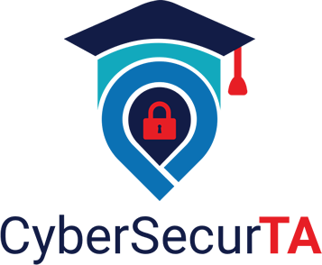

# CyberSecurTA: Building the Future of Cybersecurity Education

## Application Purpose 
The purpose of this project is to address the critical shortage of cybersecurity educators while also meeting the need for quality cybersecurity educational opportunities. By developing a platform that connects educators in need of teaching assistants (TAs) with knowledgeable cybersecurity students who are either in their final year of a bachelor's degree or attending graduate school (master’s or doctoral), the application aims to enhance the quality and accessibility of cybersecurity education nationwide. 

## Application Description
CyberSecurTA  connects cybersecurity students with teachers needing skilled TAs. The platform matches based on skills and availability, enhancing cyber education, and providing real-world teaching experience for students. This application will offer educators with needed classroom support while providing students who are considering a career in cybersecurity education with practical teaching experience. We’re hacking the gap and building the future workforce! **We’re hacking the gap and building the future workforce!** 

## Application Features
* User authentication and role-based access control
* Create and send automated invitations based on student email and type
* User profile management system with update capabilities
* Course management interface for faculty to update course lists
* School management interface for administrator to add and manage schools
* Search functionality with filters for faculty, students, and opportunities
* Create a repository system for sharing classroom resources (using external API)

## Technologies Used

The following technologies and resources were used to develop CyberSecurTA:
* Next.js: [https://nextjs.org/]
* NextAuth: [https://authjs.dev/]
* MongoDB [https://www.mongodb.com/]
* Vercel: [https://vercel.com/]
* Tailwind CSS: [https://tailwindcss.com/]
* Embla Carousel: [https://www.embla-carousel.com/]
* React Icons: [https://react-icons.github.io/react-icons/icons/ai/]

## How to Use: Getting Started

### First, ensure you have the following installed on your system and setup:
1. Node.js: [https://nodejs.org]
2. npm - this should come with Node.js
3. GitHub Desktop: [https://desktop.github.com/download/]
4. MondoDB database: [https://www.mongodb.com/]
5. Visual Studio Code: [https://code.visualstudio.com/] or another editor of your choice.

1. You can clone the repository using the following command:  
`git clone https://github.com/kristinechristensen/cybersecurta.git`
2. Navigate to the project directory:  
` cd cybersecurta`
3. Install all dependencies
`npm -i`  (make sure you have node installed)
4.  Create and set up your environmental variables by creating a `.env.local` file in the root directory. Add the following variables and your own values:  
   `MONGODB_URL = mongo connection string` 
   `NEXTAUTH_SECRET = your secret`
   `NEXTAUTH_URL = http://localhost:3000`
5. Run the dev server by typing the following command: 
`npm run dev`
6. Open your browser to http://localhost:3000 to view the page.

## Want to contribute? 
CyberSecurTA welcomes contributions from designers, developers, and cybersecurity specialists who would like to make an impact. Whether you like to fix bugs, improve documentation, or propose new features, your input and feedback are valued. 
* **Code Contributions**: Please help us improve the current application features and make recommendations for new ones. We use Next.js, MongoDB, and other technologies. We would love your help if you have previous experience with application development. 
* **Security Audits**: Since this is a cybersecurity project, we need security professionals to review our code and  suggest improvements to fortify the application.
*  **UI/UX Designers**: If you are a designer with front-end development skills, we would love your feedback and suggestions for improving the user experience and accessibility. We use TailwindCSS and React so knowing these technologies or being willing to learn them is a huge bonus!
* **Documentation**: If you like to write user manuals and tutorials then we need you! 

## Contact Us!

Please email the CyberSecureTA administrator at cybersecurTA@gmail.com if you would like to be part of the team!

